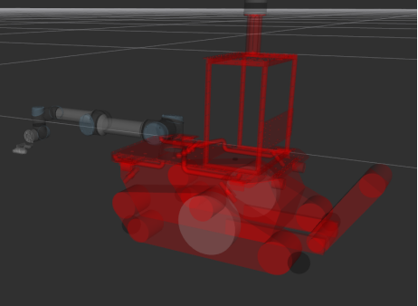
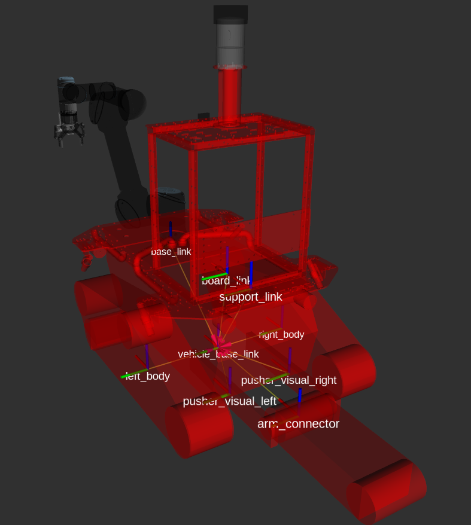
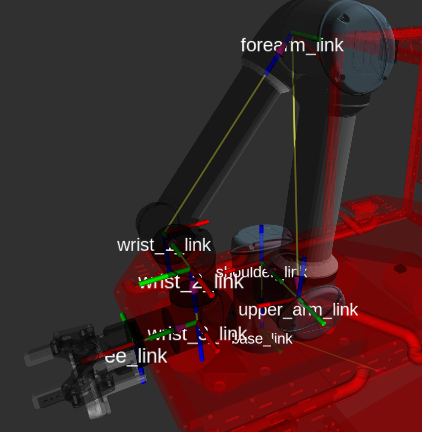
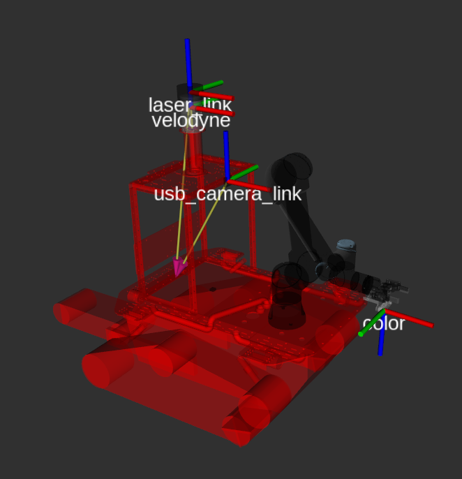

# Land Shaker Simulator

## 依赖

```bash
sudo apt install xterm ros-melodic-moveit 
sudo apt install ros-melodic-velocity-controllers
sudo apt install ros-melodic-effort-controllers
sudo apt install ros-melodic-control*
```

## 使用

**Demo1**

```bash
roslaunch mm_gazebo ls_bringup.launch world_name:=`rospack find mm_gazebo`/worlds/small_maze/smaze2d.world  model_pose:="-x 2 -y 2 -z 0.15" teleop_base:=false  # 仿真启动机器人

roslaunch mm_navigation ls_nav_demo.launch rviz:=false	# 启动导航
```

**Demo2**

```bash
roslaunch mm_gazebo ls_bringup.launch world_name:=`rospack find mm_gazebo`/worlds/square_hall.world  model_pose:="-x 0 -y -6 -z 0.15" teleop_base:=false    #仿真启动机器人 

roslaunch mm_navigation ls_nav_demo.launch rviz:=false	# 启动导航
```

**Demo3**

```bash
export GAZEBO_MODEL_PATH=$GAZEBO_MODEL_PATH:`rospack find mm_gazebo`/worlds/destruction_scenarios
roslaunch gazebo_ros empty_world.launch world_name:=`rospack find mm_gazebo`/worlds/destruction_scenarios/garage_easy.world
    
roslaunch mm_gazebo ls_bringup.launch world_enable:=true world_enable:=false  model_pose:="-z 0.2"
    
# 快捷方式
roslaunch mm_gazebo ls_bringup.launch  model_pose:="-z 0.4" world_name:=`rospack find mm_gazebo`/worlds/destruction_scenarios/garage_easy.world
```

> 这个场景很复杂，所以特别吃cpu
>
> 如果只是针对主动探索任务，可以把场景的collision注释掉

## 结构介绍

2. tf坐标系位置

   







## TODO

- 履带底盘会溜车（目前暂不能解决）
- 没有添加夹爪，如果需要夹爪的话，参考master分支

## Reference

- [gazebo_tracked_vehicle](https://git.nrs-lab.com/liyuxiang19D/gazebo_tracked_vehicle) 
- [universal_robot](https://github.com/ros-industrial/universal_robot)


export GAZEBO_MODEL_PATH=$GAZEBO_MODEL_PATH:`rospack find mm_gazebo`/worlds/depot
